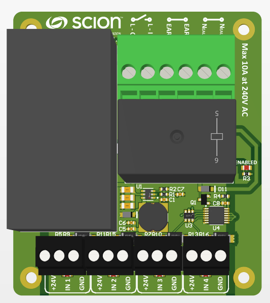
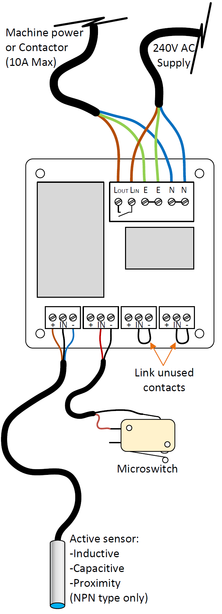

# interlock-safety-relay

A simple NOR gate based 4 channel interlock controlled relay for machine interlocking. Designed for bespoke lab equipment guard interlocking on old science equipment.

## Operation

The interlock safety relay is powered from the 240V AC mains supply to the equipment being protected. Neutral and Earth wires are looped through and the Line wire is switched by the on-board 10A relay. The relay closes the Line circuit once all of the 4 sensor inputs are shorted to their GND contact - therefore all safety interlock contacts must be closed when safe, and open when in the unsafe position. If the machine being isolated is rated to more than 10A, or runs on more than single phase power - use the output to switch a suitably rated contactor with a 240V AC coil.

## Wiring

The interlock safety relay utilises a 4 channel NOR gate for simple and reliable operation. When any 1 of the 4 sensor inputs is open circuit or unconnected, the output of the NOR gate goes low, switching the relay off. The relay is only switched on when all 4 inputs are shorted to GND. Therefore if less that 4 inputs are connected to sensors, the remaining unconnected inputs must be shorted to GND with a short wire link as shown below. The inputs can be driven by an industrial inductive, capicitive or active proximity sensor using the 24V DC supply terminal. If a simple limit switch or reed switch is used then connect it accross GND and IN only.

